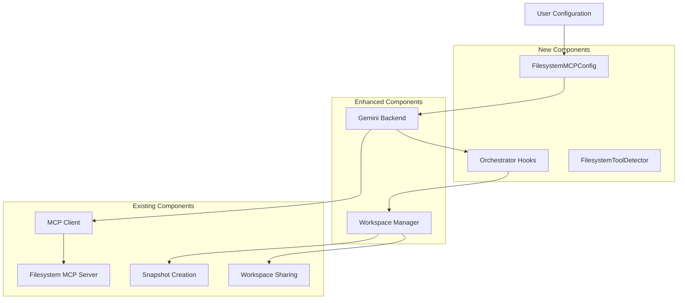
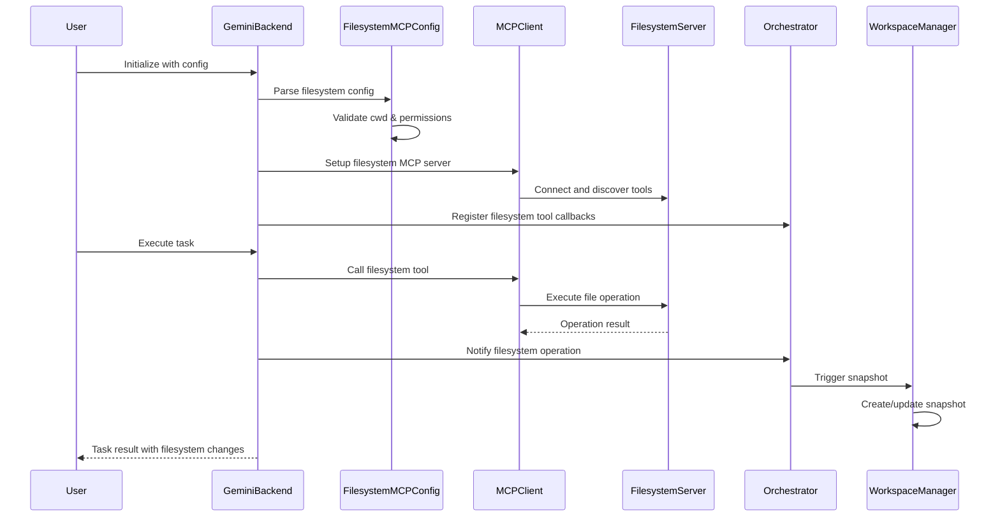

# Gemini Filesystem MCP Integration Design Document

## Executive Summary

This document outlines the design and implementation strategy for enabling Gemini backend agents to access filesystem operations through MCP (Model Context Protocol) tools, ensuring consistency with Claude Code's workspace sharing format and establishing a foundation for generalized workspace management across all backends.

## Table of Contents

1. [Background & Motivation](#background--motivation)
2. [Current State Analysis](#current-state-analysis)
3. [Design Goals & Requirements](#design-goals--requirements)
4. [Architecture Overview](#architecture-overview)
5. [Implementation Strategy](#implementation-strategy)
6. [Configuration Design](#configuration-design)
7. [Class Structure](#class-structure)
8. [Integration Points](#integration-points)
9. [Security Considerations](#security-considerations)
10. [Testing Strategy](#testing-strategy)
11. [Migration Path](#migration-path)
12. [Future Enhancements](#future-enhancements)

---

## Background & Motivation

### Current Limitation
Currently, only Claude Code agents have filesystem access through built-in tools (Read, Write, Edit, Bash, etc.) and workspace sharing capabilities. Gemini agents are limited to their built-in search and code execution tools, creating an inconsistency in multi-agent scenarios where file sharing and collaboration are needed.

### Business Case
- **Agent Parity**: Enable Gemini agents to participate in file-based workflows alongside Claude Code agents
- **Workspace Sharing**: Allow Gemini agents to read/write to shared workspaces for collaborative tasks
- **MCP Ecosystem**: Leverage existing filesystem MCP servers instead of building proprietary solutions
- **Scalability**: Create a reusable pattern for enabling filesystem access in any backend

### Key References
- **v0.0.14 Context Sharing**: As outlined in `docs/dev_notes/v0.0.14-context.md`
- **v0.0.16 Roadmap**: Filesystem MCP integration planned in `ROADMAP_v0.0.16.md`
- **Claude Code Format**: Configuration pattern in `massgen/configs/tools/mcp/claude_code_discord_mcp_example.yaml`

---

## Current State Analysis

### Claude Code Behavior
Claude Code provides **built-in filesystem tools** when `cwd` is configured:
- **Built-in Tools**: Read, Write, Edit, MultiEdit, Bash, Grep, Glob, LS, etc.
- **Workspace Management**: Auto-creates and manages `cwd` directory
- **Permission Modes**: `bypassPermissions`, `acceptEdits`, `strict`
- **MCP Integration**: Optional, for additional tools beyond built-ins

```yaml
agent:
  backend:
    type: "claude_code"
    cwd: "claude_code_workspace"
    permission_mode: "bypassPermissions"
    # MCP servers are optional - filesystem tools are built-in
```

### Gemini Current Format
```yaml
agents:
  - id: "gemini2.5flash_mcp_weather"
    backend:
      type: "gemini"
      model: "gemini-2.5-flash"
      mcp_servers:
        - name: "weather"
          type: "stdio"
          command: "npx"
          args: ["-y", "@fak111/weather-mcp"]
```

### Gap Analysis
1. **Built-in Filesystem Tools**: Gemini lacks Claude Code's built-in Read, Write, Edit, Bash, etc.
2. **Workspace Management**: Gemini lacks `cwd` auto-creation and management
3. **Permission System**: No `permission_mode` support
4. **Tool Integration**: Currently relies only on MCP servers, no built-in tools

---

## Design Goals & Requirements

### Functional Requirements
1. **Identical Configuration**: Gemini must support exact same `cwd` and `permission_mode` as Claude Code
2. **Identical Built-in Tools**: Gemini gets the same Read, Write, Edit, MultiEdit, Bash, Grep, Glob, LS tools
3. **Identical Workspace Behavior**: Auto-create `cwd`, clear existing files, set as working directory
4. **Identical Permission Modes**: Support `bypassPermissions`, `acceptEdits`, `strict` modes
5. **Workspace Sharing**: Automatic workspace snapshot/sharing when filesystem operations are detected
6. **Tool Detection**: Automatic detection of filesystem operations for workspace triggers
7. **Backward Compatibility**: Existing Gemini configs continue to work unchanged

### Non-Functional Requirements
1. **Security**: Same security model as Claude Code (`bypassPermissions`, `strict`, etc.)
2. **Performance**: Minimal overhead for non-filesystem operations
3. **Reliability**: Robust error handling and connection management
4. **Maintainability**: Clean separation of concerns and reusable components

### Technical Requirements
1. **Configuration Class**: Dedicated class to read and validate filesystem MCP config
2. **Tool Registry**: Centralized registry of filesystem tool names for detection
3. **Orchestrator Hooks**: Integration points for workspace snapshot triggers
4. **Format Consistency**: Use Claude Code's naming conventions and structure

---

## Architecture Overview

### High-Level Architecture



### Component Interactions



---

## Implementation Strategy

### Phase 1: MCP Configuration Converter
1. **Create MCPFilesystemConverter Class**
   - Detect `cwd` and `permission_mode` in Gemini backend config
   - Convert these to filesystem MCP server configuration
   - Inject the generated MCP server into existing `mcp_servers` list
   - Let existing MCP infrastructure handle the rest

2. **Workspace Directory Setup**
   - Auto-create `cwd` directory if it doesn't exist
   - Clear existing files in `cwd` on initialization (like Claude Code)
   - Pass `cwd` as parameter to filesystem MCP server

### Phase 2: Leverage Existing MCP Interface
1. **Use Current MCP Client**
   - No changes needed to existing MCP client code
   - Filesystem MCP server gets discovered and registered automatically
   - Tools become available as `mcp__filesystem__read_file`, etc.

2. **Reuse Existing MCP Infrastructure**
   - Tool discovery, registration, execution all handled by current code
   - Security validation through existing MCP security module
   - Error handling through existing MCP exception system

### Phase 3: Orchestrator Integration (Minimal Changes)
1. **Tool Detection Enhancement**
   - Extend existing filesystem tool detector to recognize generated MCP tools
   - Trigger workspace snapshots when filesystem MCP tools are used
   - Reuse existing workspace sharing logic

2. **Permission Integration**
   - Pass `permission_mode` to filesystem MCP server configuration
   - Let MCP server handle permission enforcement
   - No need for separate permission system


3. **Integration Testing**
   - Test Gemini + Claude Code workspace sharing
   - Verify existing MCP infrastructure works with filesystem tools
   - End-to-end workflow compatibility

---

## Configuration Design

### Identical Gemini Configuration (Matching Claude Code Exactly)

```yaml
# Example: massgen/configs/tools/filesystem/gemini_filesystem_example.yaml
# IDENTICAL to Claude Code configuration format
agents:
  - id: "gemini_filesystem_agent"
    backend:
      type: "gemini"
      model: "gemini-2.5-flash"

      # IDENTICAL to Claude Code: These two lines enable filesystem access
      cwd: "gemini_workspace_shared"
      permission_mode: "bypassPermissions"  # or "acceptEdits", "strict"

      # OPTIONAL: MCP servers work exactly like in Claude Code
      mcp_servers:
        weather:
          type: "stdio"
          command: "npx"
          args: ["-y", "@fak111/weather-mcp"]

    system_message: |
      You are an AI assistant with filesystem access.
      You have the same tools as Claude Code: Read, Write, Edit, MultiEdit, Bash, Grep, Glob, LS.

ui:
  display_type: "rich_terminal"
  logging_enabled: true
```

### Direct Claude Code Equivalent

```yaml
# Gemini version (NEW)
agents:
  - id: "gemini_agent"
    backend:
      type: "gemini"
      cwd: "shared_workspace"
      permission_mode: "bypassPermissions"

# Claude Code version (EXISTING) - identical structure
agent:
  id: "claude_code_agent"
  backend:
    type: "claude_code"
    cwd: "shared_workspace"
    permission_mode: "bypassPermissions"
```

### Backward Compatibility

```yaml
# Existing configurations continue to work unchanged
agents:
  - id: "gemini2.5flash_mcp_weather"
    backend:
      type: "gemini"
      model: "gemini-2.5-flash"
      # No cwd/permission_mode = no filesystem access (current behavior)
      mcp_servers:
        - name: "weather"
          type: "stdio"
          command: "npx"
          args: ["-y", "@fak111/weather-mcp"]
```

---

## Class Structure

### MCPFilesystemConverter Class

```python
# massgen/mcp_tools/filesystem_converter.py

from dataclasses import dataclass
from typing import Optional, Dict, Any, List
from pathlib import Path
import shutil

class MCPFilesystemConverter:
    """Converts cwd/permission_mode config to MCP server configuration."""

    def __init__(self):
        self.filesystem_server_name = "filesystem"

    def should_add_filesystem_server(self, config: Dict[str, Any]) -> bool:
        """Check if config has cwd/permission_mode requiring filesystem MCP server."""
        return bool(config.get("cwd")) or bool(config.get("permission_mode"))

    def setup_workspace_directory(self, cwd: str) -> str:
        """Setup workspace directory like Claude Code does."""
        if not cwd:
            return cwd

        cwd_path = Path(cwd)
        if not cwd_path.is_absolute():
            cwd_path = cwd_path.resolve()

        # Clear existing files if directory exists (like Claude Code)
        if cwd_path.exists() and cwd_path.is_dir():
            for item in cwd_path.iterdir():
                if item.is_file():
                    item.unlink()
                elif item.is_dir():
                    shutil.rmtree(item)

        # Create directory if it doesn't exist
        cwd_path.mkdir(parents=True, exist_ok=True)

        return str(cwd_path)

    def generate_filesystem_mcp_server(self, cwd: str, permission_mode: str) -> Dict[str, Any]:
        """Generate filesystem MCP server configuration."""
        # Setup workspace directory first
        workspace_path = self.setup_workspace_directory(cwd)

        # Generate MCP server config that existing MCP client can understand
        return {
            "name": self.filesystem_server_name,
            "type": "stdio",
            "command": "python",
            "args": [
                "-m", "massgen.mcp_servers.filesystem_server",
                "--workspace", workspace_path,
                "--permission-mode", permission_mode
            ],
            # Internal metadata (not sent to MCP client)
            "_generated": True,
            "_cwd": workspace_path,
            "_permission_mode": permission_mode
        }

    def inject_filesystem_server(self, config: Dict[str, Any]) -> Dict[str, Any]:
        """Inject filesystem MCP server into existing mcp_servers config."""
        if not self.should_add_filesystem_server(config):
            return config

        # Extract cwd and permission_mode
        cwd = config.get("cwd")
        permission_mode = config.get("permission_mode", "strict")

        # Generate filesystem MCP server
        filesystem_server = self.generate_filesystem_mcp_server(cwd, permission_mode)

        # Get existing mcp_servers (could be list or dict format)
        existing_servers = config.get("mcp_servers", [])

        # Convert to list format if needed
        if isinstance(existing_servers, dict):
            server_list = []
            for name, server_config in existing_servers.items():
                server_config["name"] = name
                server_list.append(server_config)
            existing_servers = server_list

        # Check if filesystem server already exists
        has_filesystem = any(
            server.get("name") == self.filesystem_server_name
            for server in existing_servers
        )

        if not has_filesystem:
            # Add filesystem server to the beginning
            existing_servers.insert(0, filesystem_server)

        # Update config
        updated_config = config.copy()
        updated_config["mcp_servers"] = existing_servers

        return updated_config

    @classmethod
    def convert_config(cls, config: Dict[str, Any]) -> Dict[str, Any]:
        """Main conversion method - convert cwd/permission_mode to MCP server."""
        converter = cls()
        return converter.inject_filesystem_server(config)
```

### Integration with Existing MCP Infrastructure

```python
# massgen/v1/backends/gemini.py (integration example)

from massgen.mcp_tools.filesystem_converter import MCPFilesystemConverter

class GeminiBackend:
    def __init__(self, config: dict, orchestrator_callback=None):
        # CONVERT config before existing MCP processing
        config = MCPFilesystemConverter.convert_config(config)

        # Existing MCP initialization continues unchanged
        # The filesystem MCP server is now in mcp_servers list
        # Current MCP client discovers and registers filesystem tools automatically
        super().__init__(config, orchestrator_callback)
```

---

## Integration Points

### Gemini Backend Integration

```python
# massgen/v1/backends/gemini.py (enhanced)

from massgen.mcp_tools.filesystem_config import FilesystemMCPConfig
from massgen.mcp_tools.filesystem_detector import FilesystemToolDetector

class GeminiBackend:
    def __init__(self, config: dict, orchestrator_callback=None):
        # Existing initialization...

        # NEW: Filesystem MCP configuration
        self.filesystem_config = FilesystemMCPConfig.from_dict(config)
        self.filesystem_detector = FilesystemToolDetector()

        # Register orchestrator callback for workspace triggers
        if orchestrator_callback and self.filesystem_config.has_filesystem_access():
            self.filesystem_detector.register_callback(
                self._on_filesystem_operation
            )

    def _on_filesystem_operation(self, tool_name: str, args: dict):
        """Handle detected filesystem operation."""
        # Notify orchestrator for workspace snapshot/sharing
        if hasattr(self, 'orchestrator_callback'):
            self.orchestrator_callback('filesystem_operation', {
                'agent_id': self.agent_id,
                'tool_name': tool_name,
                'workspace': self.filesystem_config.cwd,
                'operation_args': args
            })

    def execute_tool(self, tool_name: str, args: dict):
        """Execute MCP tool with filesystem detection."""
        # Existing tool execution...
        result = super().execute_tool(tool_name, args)

        # NEW: Notify filesystem detector
        self.filesystem_detector.notify_filesystem_operation(tool_name, args)

        return result
```

### Orchestrator Integration

```python
# massgen/orchestrator.py (enhanced)

class Orchestrator:
    def __init__(self):
        # Existing initialization...
        self.workspace_triggers = set()

    def register_agent(self, agent):
        """Register agent with filesystem operation callbacks."""
        # Existing registration...

        # NEW: Register filesystem operation callback
        if hasattr(agent, 'filesystem_detector'):
            agent.filesystem_detector.register_callback(
                self._handle_filesystem_operation
            )

    def _handle_filesystem_operation(self, tool_name: str, args: dict):
        """Handle filesystem operation from any agent."""
        # Extract agent and workspace info
        agent_id = args.get('agent_id')
        workspace = args.get('workspace')

        # Trigger workspace snapshot (existing logic)
        self.trigger_workspace_snapshot(agent_id, workspace)

        # NEW: Enable workspace sharing for other agents
        self.update_shared_workspace_access(workspace)

    def update_shared_workspace_access(self, workspace: str):
        """Update workspace access for collaborative agents."""
        # Implementation to share workspace across agents
        # This extends existing Claude Code workspace sharing
        pass
```

---

## Security Considerations

### Permission Mode Implementation

```python
# massgen/mcp_tools/filesystem_security.py

class FilesystemSecurityManager:
    """Manages filesystem security based on permission mode."""

    def __init__(self, permission_mode: str, base_workspace: str):
        self.permission_mode = permission_mode
        self.base_workspace = Path(base_workspace).resolve()

    def validate_path_access(self, requested_path: str, operation: str) -> bool:
        """Validate if path access is allowed based on permission mode."""
        if self.permission_mode == "bypassPermissions":
            return True

        requested_path = Path(requested_path).resolve()

        if self.permission_mode == "strict":
            # Only allow access within workspace
            try:
                requested_path.relative_to(self.base_workspace)
                return True
            except ValueError:
                return False

        elif self.permission_mode == "moderate":
            # Allow workspace + some system paths
            allowed_roots = [
                self.base_workspace,
                Path.home() / "Documents",
                Path("/tmp") if os.name != 'nt' else Path(os.getenv("TEMP", ""))
            ]
            return any(
                self._is_path_under_root(requested_path, root)
                for root in allowed_roots
            )

        return False

    def _is_path_under_root(self, path: Path, root: Path) -> bool:
        """Check if path is under root directory."""
        try:
            path.relative_to(root.resolve())
            return True
        except ValueError:
            return False
```

### Security Best Practices

1. **Path Validation**: All file paths validated against workspace boundaries
2. **Permission Inheritance**: Gemini agents inherit Claude Code security model
3. **Audit Logging**: All filesystem operations logged for security review
4. **Sandboxing**: Strict mode restricts access to designated workspace only
5. **Input Sanitization**: Tool arguments sanitized before filesystem operations

---

## Testing Strategy

### Unit Tests

```python
# tests/test_filesystem_mcp_config.py

import pytest
from massgen.mcp_tools.filesystem_config import FilesystemMCPConfig

class TestFilesystemMCPConfig:
    def test_valid_config_creation(self):
        config = FilesystemMCPConfig(
            cwd="test_workspace",
            permission_mode="strict",
            filesystem_servers=[{
                "name": "filesystem",
                "command": "python",
                "args": ["-m", "filesystem_mcp_server"]
            }]
        )
        assert config.cwd == "test_workspace"
        assert config.permission_mode == "strict"

    def test_invalid_permission_mode(self):
        with pytest.raises(ValueError, match="Invalid permission_mode"):
            FilesystemMCPConfig(permission_mode="invalid")

    def test_from_dict_parsing(self):
        config_dict = {
            "cwd": "workspace",
            "permission_mode": "bypassPermissions",
            "mcp_servers": [{
                "name": "filesystem",
                "command": "python",
                "args": ["-m", "filesystem_mcp_server"]
            }]
        }
        config = FilesystemMCPConfig.from_dict(config_dict)
        assert config.has_filesystem_access()
```

### Integration Tests

```python
# tests/test_gemini_filesystem_integration.py

import pytest
from massgen.v1.backends.gemini import GeminiBackend
from massgen.mcp_tools.filesystem_config import FilesystemMCPConfig

class TestGeminiFilesystemIntegration:
    @pytest.fixture
    def filesystem_config(self):
        return {
            "type": "gemini",
            "model": "gemini-2.5-flash",
            "cwd": "test_workspace",
            "permission_mode": "strict",
            "mcp_servers": [{
                "name": "filesystem",
                "command": "python",
                "args": ["-m", "test_filesystem_server"]
            }]
        }

    def test_filesystem_config_initialization(self, filesystem_config):
        backend = GeminiBackend(filesystem_config)
        assert backend.filesystem_config.has_filesystem_access()
        assert backend.filesystem_config.cwd == "test_workspace"

    def test_filesystem_operation_detection(self, filesystem_config):
        backend = GeminiBackend(filesystem_config)

        # Mock filesystem operation
        detected = backend.filesystem_detector.is_filesystem_operation(
            "mcp__filesystem__read_file"
        )
        assert detected
```

### End-to-End Tests

```python
# tests/test_workspace_sharing_e2e.py

def test_gemini_claude_workspace_sharing():
    """Test workspace sharing between Gemini and Claude Code agents."""
    # Setup Gemini agent with filesystem MCP
    gemini_config = {
        "type": "gemini",
        "cwd": "shared_workspace",
        "mcp_servers": [{"name": "filesystem", ...}]
    }

    # Setup Claude Code agent with same workspace
    claude_config = {
        "type": "claude_code",
        "cwd": "shared_workspace",
        "permission_mode": "bypassPermissions"
    }

    # Test file creation by Gemini, reading by Claude Code
    # Test workspace snapshot creation
    # Test cross-agent file access
```

---

## Migration Path

### Existing Configuration Compatibility

1. **Zero Breaking Changes**: All existing Gemini configs continue to work
2. **Opt-in Filesystem Access**: Only configs with `cwd` enable filesystem features
3. **Gradual Migration**: Users can add filesystem support incrementally

### Migration Steps

```yaml
# Step 1: Current configuration (no changes needed)
agents:
  - id: "gemini_weather"
    backend:
      type: "gemini"
      mcp_servers:
        - name: "weather"
          # ... existing config

# Step 2: Add workspace (enables filesystem features)
agents:
  - id: "gemini_weather"
    backend:
      type: "gemini"
      cwd: "gemini_workspace"  # NEW: enables filesystem
      mcp_servers:
        - name: "weather"
          # ... existing config

# Step 3: Add filesystem MCP server (full filesystem access)
agents:
  - id: "gemini_weather"
    backend:
      type: "gemini"
      cwd: "gemini_workspace"
      mcp_servers:
        - name: "filesystem"  # NEW: filesystem tools
          type: "stdio"
          command: "python"
          args: ["-m", "filesystem_mcp_server"]
        - name: "weather"
          # ... existing config
```
